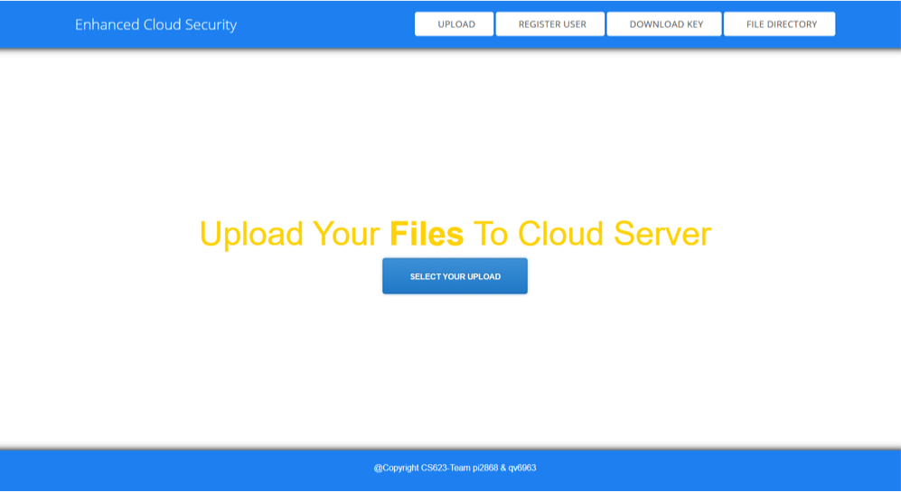

## Enhanced Cloud Security using Diffie–Hellman key exchange Algorithm

This project will provide secure file storage cloud using encryption and security algorithm. The algorithm performs encryption of the file stored on cloud and using Diffie-Hellman for authenticating the user to decrypt the required file using flask with python and this system using Amazon Elastic Compute Cloud service to provide storage platform to the users.



### Diffie–Hellman key exchange Algorithm

Diffie–Hellman key exchange (DH) is a method of securely exchanging cryptographic keys over a public channel and was one of the first public-key protocols named after Whitfield Diffie and Martin Hellman. DH is one of the earliest practical examples of public key exchange implemented within the field of cryptography.


### Build with

| Platform      | 			Languages/Services 					  |
| ----------- 	|	 --------------------------------- 			  |
| Frontend      | 		Python-Flask, HTML, CSS, JavaScript       |
| Backend   	| 					Pickle        				  |
| Servers   	| 				Nginx, Gunicorn3        		  |
|Cloud Services | 			Amazon Elastic Compute Cloud          |


### Dependencies

```javascript
python-flask
hashlib
pycrypto
scretsharing
tkinter
webbrowser
```

Hosting on AWS

- Fork this repository
- Create an amazon EC2 instances
- Select and create Ubuntu Server 18.04 LTS (HVM), SSD Volume Type
- While creating the instances, in Configure Security Group Menu. Enabled TCP, HTTP, HTTPs, and, RDP ans change Source to Anywhere
- Create new key pair then download and keep .pem file in your local machine
- Open AWS machine dashborad and copy the IPv4 Public IP address of your instance


- In the Command line login to your Ubuntu server
- Enter the command ssh -i <keypair>.pem ubuntu@name of your IPv4 Public IP address
- Install all dependencies
- Enter command sudo service nginx restart
- Enter command sudo service gnicorn3 restart


### Future Enhancement 

1.In short period, we are able to implement system for text encryption only but in future we can implement for more file types.</br>
2.We can add more security algorithms along with Diffie- Hellman, so users have more option for safe upload in system.</br>
3.We can implement login functionality, sharing functionality for uploaded document and many more to system and for batter data management we can use database instead of pickle.

### Created by

Nidhi Patel</br>
Akrati Mahajan

Project link: https://github.com/Akrati25/CloudComputing


