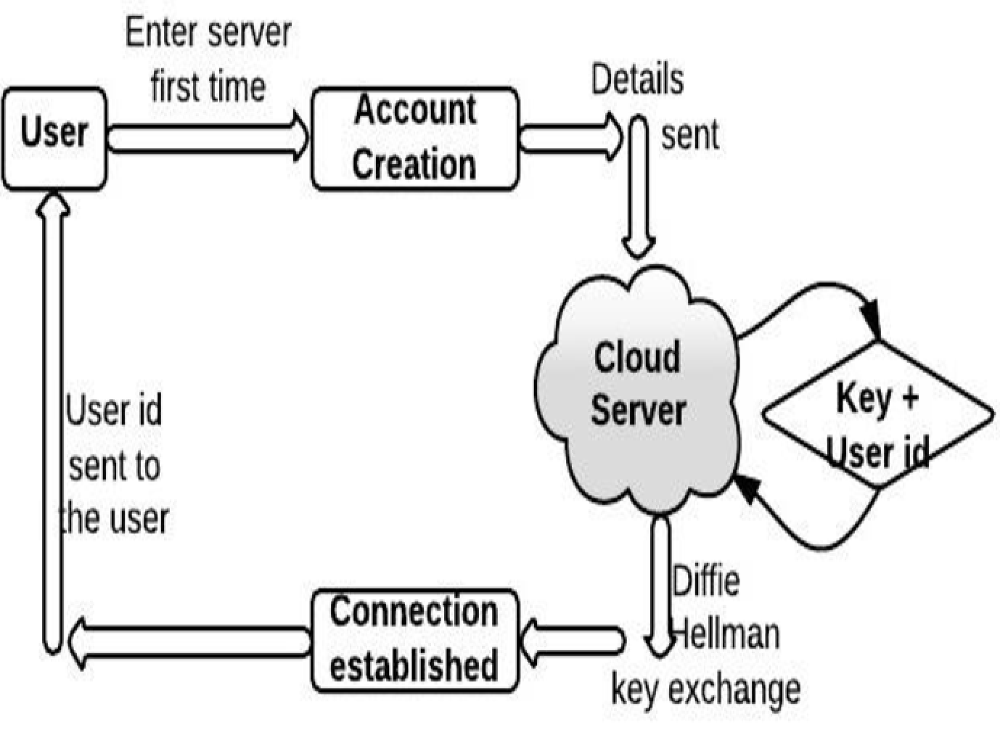

# Enhanced Cloud Security using Diffie–Hellman key exchange Algorithm

This project will provide secure file storage cloud using encryption and security algorithm. The algorithm performs encryption of the file stored on cloud and using Diffie-Hellman for authenticating the user to decrypt the required file using flask with python and this system using Amazon Elastic Compute Cloud service to provide storage platform to the users.

# Diffie–Hellman key exchange Algorithm

Diffie–Hellman key exchange (DH) is a method of securely exchanging cryptographic keys over a public channel and was one of the first public-key protocols named after Whitfield Diffie and Martin Hellman. DH is one of the earliest practical examples of public key exchange implemented within the field of cryptography.

# Build with

| Platform      | 			Languages/Services 					  |
| ----------- 	|	 --------------------------------- 			  |
| Frontend      | 		Python-Flask, HTML, CSS, JavaScript       |
| Backend   	| 					Pickle        				  |
| Backend   	| 				Nginx, Gunicorn3        		  |
| Backend   	| 			Amazon Elastic Compute Cloud          |

